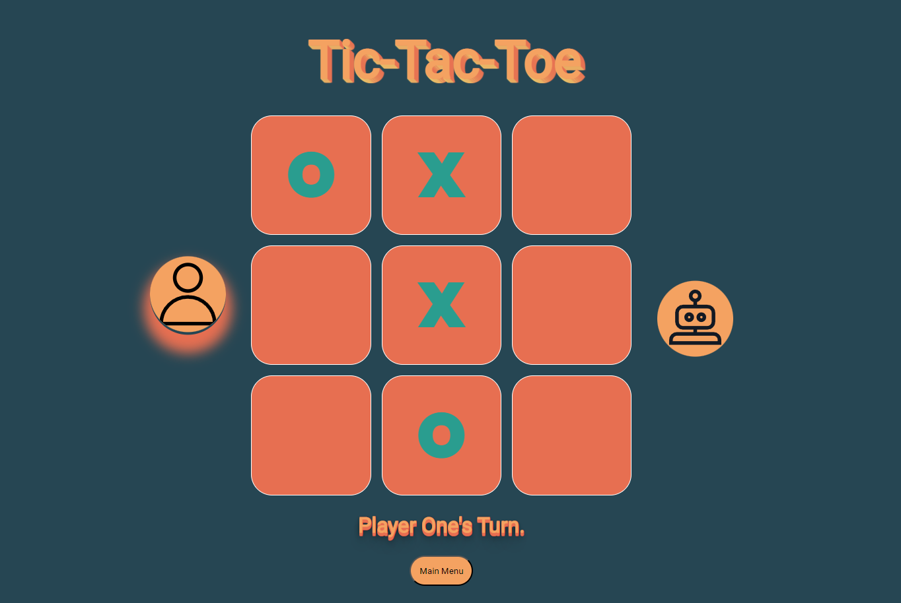

# Tic Tac Toe - Human vs AI

A Tic Tac Toe web game built using HTML, CSS, and JavaScript that allows users to play against another human on the same machine or against three different AI difficulties: easy, medium, and hard.

## Table of Contents

1. [Introduction](#introduction)
2. [Technologies](#technologies)
3. [Features](#features)
4. [AI Difficulties](#ai-difficulties)
5. [How to Play](#how-to-play)
6. [Future Improvements](#future-improvements)
7. [Conclusion](#conclusion)

## Introduction

This project is a web-based implementation of the classic Tic Tac Toe game, with the added ability to play against AI with varying levels of difficulty. Users can choose to play against a friend on the same machine or test their skills against the computer.

## Technologies

The following technologies were used to build this project:

- HTML5
- CSS3
- JavaScript (ES6)

## Features

- Human vs. Human mode
- Human vs. AI mode
- Three AI difficulties: Easy, Medium, and Hard
- Responsive design for desktop and mobile devices
- Game state persistence
- Reset functionality to restart the game

## AI Difficulties

1. **Easy**: The AI selects a random valid move on the game board.
2. **Medium**: The AI uses the Mini-Max algorithm but makes a random move 50% of the time.
3. **Hard**: The AI is unbeatable, utilizing a full implementation of the Mini-Max algorithm to always make the optimal move.

## How to Play

1. Open the game in your preferred browser.
2. Select the game mode (Human vs. Human or Human vs. AI).
3. If playing against AI, choose the desired difficulty level (Easy, Medium, or Hard).
4. Click on an empty cell on the board to make your move.
5. The game will automatically detect and announce the winner or a draw when the game ends.
6. Use the "Reset" button to restart the game at any time.

## Future Improvements

Possible enhancements for this project:

1. Implementing a more sophisticated AI using a neural network or reinforcement learning
2. Multiplayer mode via online networking
3. Additional customizable settings (board size, player symbols, etc.)
4. Animations and improved visual effects
5. Audio feedback and background music
6. Score tracking and player statistics

## Conclusion

This Tic Tac Toe web game demonstrates proficiency in HTML, CSS, and JavaScript while providing an entertaining experience for users. The integration of AI with varying difficulties offers an engaging challenge for players of different skill levels.
